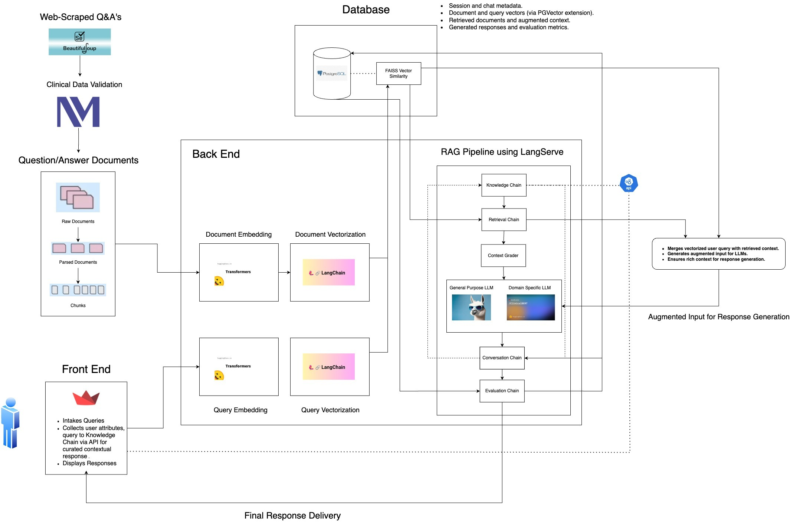

# CancerRAG : A RAG-Based LLM for Radiation Oncology Patient Queries
Fork of Northwestern MLDS CancerRAG Project

## **Introduction**

The proposed project seeks to bridge the communication gap between patients and clinicians in the field of radiation oncology by developing an advanced **Retrieval-Augmented Generation (RAG)-based Large Language Model (LLM)**. Cancer treatment is inherently complex, involving multifaceted medical, emotional, and logistical considerations. Patients often find it challenging to retain and process the extensive information provided during consultations, particularly regarding sensitive topics such as body image, mental health, and emotional well-being. These challenges can lead to misunderstandings, anxiety, and diminished satisfaction with care.

To address this critical issue, the project will design and implement an **AI-powered chatbot** specifically tailored for radiation oncology. This chatbot will leverage cutting-edge RAG techniques and domain-specific LLMs to deliver responses that are not only factually accurate but also empathetic and contextually aware. By integrating reliable medical knowledge with a conversational interface, the solution aims to:
  
1. **Enhance Patient Understanding**: Provide clear and concise explanations of treatment plans, side effects, and post-treatment care.  
2. **Support Emotional Well-being**: Address sensitive topics with empathy, offering reassurance and resources to help patients cope with their journey.  
3. **Improve Accessibility**: Enable patients to revisit information or seek clarification at their convenience, reducing dependence on clinicians for follow-up queries.  
4. **Streamline Communication**: Allow clinicians to focus on advanced medical tasks by offloading routine inquiries to an intelligent, automated system.  
5. **Build Trust**: Ensure responses are grounded in authoritative sources and medical guidelines, fostering confidence among patients.

By improving the accessibility, clarity, and quality of patient communication, this project aspires to enhance overall patient satisfaction and contribute to better health outcomes in the oncology domain.

## **Pipeline of RAG Deployment**

